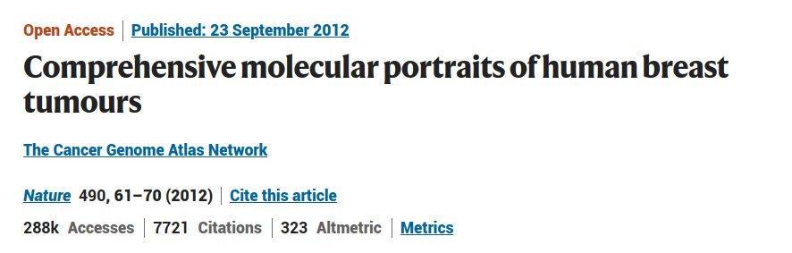
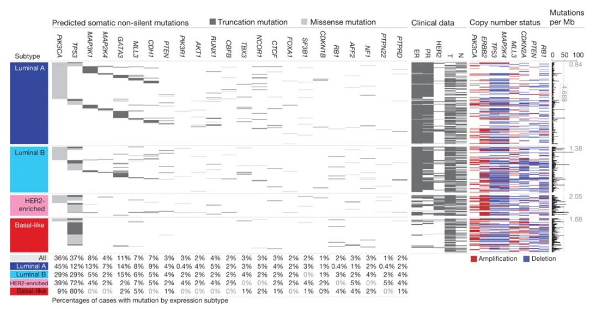
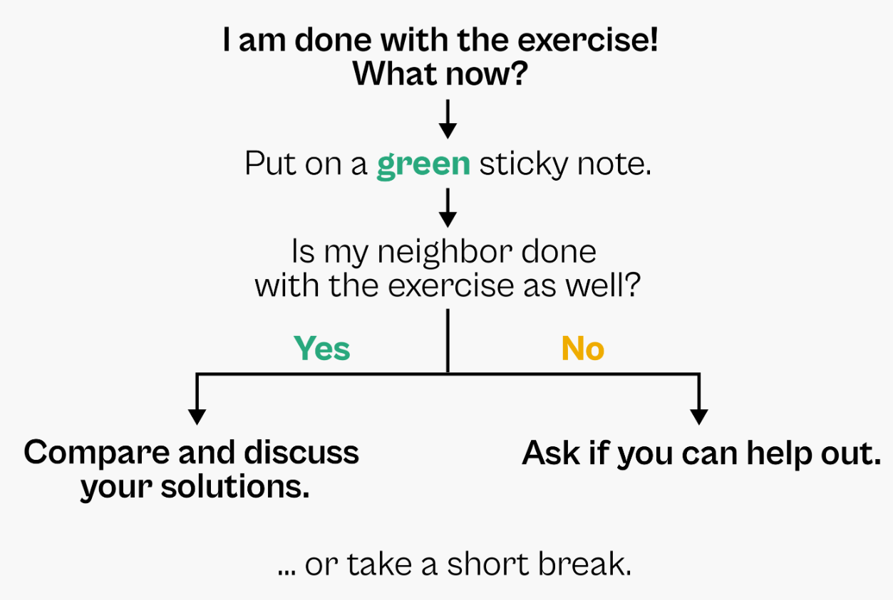

# palmerpenguins data set

```{r packages}
library(palmerpenguins)
library(tidyverse)
library(patchwork)
library(GGally)
library(ggsankey)
library(knitr)

knit_print.data.frame <- function (x, options, ...) {
  rmarkdown::paged_table(x, options) |>
    rmarkdown:::print.paged_df()
}

registerS3method("knit_print", "data.frame", knit_print.data.frame)
```

## LTER Penguins

{width="75%"}

## Data set {.smaller}

::: {.columns}

::: {.column width="40%"}

The [palmerpenguins](https://github.com/allisonhorst/palmerpenguins) data set = 344 penguins 

- specie name
- island 
- sex 
- year

Measurements:

- bill length,  
- bill depth,   
- flipper length and  
- body mass.  

:::

::: {.column width="60%"}
{width="50%"}
{width="50%"}

:::

::::


## penguins data.frame {.smaller}

```{r}
set.seed(7)
penguins_df <-
  penguins %>%
  # keep only rows that have all measurements
  filter(if_all(contains(c("_mm", "_g")), function(x) !is.na(x))) %>%
  # add id for penguins
  mutate(penguin_id = ids::adjective_animal(n()))

penguins_df %>%
  slice_sample(n = 5)
```

```{r}
col_names <-
  c("Bill length [mm]" = "bill_length_mm", 
    "Bill depth [mm]" = "bill_depth_mm", 
    "Flipper length [mm]" = "flipper_length_mm",
    "Body mass [g]" = "body_mass_g")
```

## penguins data

```{r}
island_cols <- ggsci::pal_futurama()(3)
names(island_cols) <- levels(penguins_df$island)
specie_cols <- ggsci::pal_jama()(3)
names(specie_cols) <- levels(penguins_df$species)
penguins_df %>%
  make_long(species, island) %>%
  ggplot(aes(x = x, 
             next_x = next_x, 
             node = node, 
             next_node = next_node,
             label = node,
             fill = factor(node))) +
  geom_sankey() +
  theme_sankey(base_size = 16) +
  scale_fill_manual(values = c(island_cols, specie_cols)) +
  geom_sankey_label(size = 3.5, color = 1, fill = "white") +
  theme(axis.title = element_blank(), legend.position = "none")
```

## penguins data - exploration

```{r, fig.width=7, fig.height=5}
penguins_df %>%
  rename(col_names) %>%
  ggpairs(., 
          columns = names(col_names),
          mapping = aes(color = species),
          upper = list(continuous = wrap(ggally_cor, 
                                         display_grid = FALSE))) +
  ggsci::scale_color_jama() +
  ggsci::scale_fill_jama()
```


## penguins data - exploration

```{r, fig.width=7, fig.height=5}
penguins_df %>%
  rename(all_of(col_names)) %>%
  ggpairs(., 
          columns = names(col_names),
          mapping = aes(color = island),
          upper = list(continuous = wrap(ggally_cor, 
                                         display_grid = FALSE))) +
  ggsci::scale_color_futurama() +
  ggsci::scale_fill_futurama() 
```


# PCA

## Input matrix

```{r}
#| echo: true
#| code-line-numbers: "4-6"
penguins_mat <-
  penguins_df %>%
  mutate(row_names = penguin_id) %>%
  select(penguin_id, 
         bill_length_mm, bill_depth_mm, 
         flipper_length_mm, body_mass_g) %>%
  column_to_rownames("penguin_id") %>%
  as.matrix()
```

## Input matrix

```{r}
#| echo: true
penguins_mat[1:5,]
```

## Input matrix - raw

```{r}
pen_mat <- penguins_mat
colnames(pen_mat) <- names(col_names)
ComplexHeatmap::Heatmap(pen_mat, 
                        col = viridis::inferno(50),
                        show_row_names = FALSE, 
                        show_column_names = TRUE, 
                        cluster_rows = FALSE,
                        cluster_columns = FALSE)
```

## Scaled matrix

```{r}
#| echo: true
penguins_scaled_mat <- 
  penguins_mat %>%
  scale

penguins_scaled_mat[1:3, 1:3]
```

## Scaled matrix

```{r}
pen_scaled_mat <- penguins_scaled_mat
colnames(pen_scaled_mat) <- names(col_names)
ComplexHeatmap::Heatmap(pen_scaled_mat, 
                        show_row_names = FALSE, 
                        col = viridis::inferno(50),
                        show_column_names = TRUE, 
                        cluster_rows = FALSE,
                        cluster_columns = FALSE)
```

## Running PCA

```{r}
#| echo: true
penguins_pca <- prcomp(penguins_scaled_mat)
```

## Running PCA

```{r}
#| echo: true
penguins_pca <- prcomp(penguins_scaled_mat)

str(penguins_pca)
```

## Running PCA

```{r}
#| echo: true
penguins_pca <- prcomp(penguins_scaled_mat)
```


```{r}
penguins_pca_df <-
  penguins_pca$x %>%
  as.data.frame() %>%
  rownames_to_column("penguin_id") %>%
  full_join(penguins_df)
```

```{r}
penguins_pca_df %>%
  ggplot(aes(PC1, PC2)) +
  geom_point()
```

## PCA - variance explained

```{r}
#| echo: true
var_expl <- penguins_pca$sdev^2 / sum(penguins_pca$sdev^2)
names(var_expl) <- paste0("PC", 1:length(var_expl))

barplot(var_expl, col = "darkgreen", 
        main = "Variance explained by Principal Components")
```

## PCA representation

```{r}
penguins_pca_df %>%
  ggpairs(., 
          columns = paste0("PC", 1:4),
          mapping = aes(color = island),
          upper = list(continuous = wrap(ggally_cor, 
                                         display_grid = FALSE))) +
  ggsci::scale_color_futurama() +
  ggsci::scale_fill_futurama() 
```

## PCA representation

```{r}
penguins_pca_df %>%
  ggpairs(., 
          columns = paste0("PC", 1:4),
          mapping = aes(color = species),
          upper = list(continuous = wrap(ggally_cor, 
                                         display_grid = FALSE))) +
  ggsci::scale_color_jama() +
  ggsci::scale_fill_jama()
```

## PCA - exploration

```{r}
penguins_rotation_df <-
  penguins_pca$rotation %>%
  as.data.frame() %>%
  rownames_to_column("mes") %>%
  left_join(tibble(mes = col_names, measurement = names(col_names))) %>%
  select(-mes) %>%
  as_tibble() %>%
  pivot_longer(names_to = "pc",
               values_to = "value",
               -measurement)

penguins_rotation_df %>%
  mutate(direction = sign(value)) %>%
  group_by(pc) %>%
  mutate(value2 = direction*abs(value)/sum(abs(value))) %>%
  ggplot(aes(x = measurement, y = value2)) +
  geom_bar(stat = "identity") +
  facet_wrap(~pc) +
  labs(y = "Contirbution") + 
  theme(axis.text.x = element_text(angle = 60, hjust = 1),
        axis.title.x = element_blank())
```

## PCA - exploration

```{r}
temp_df <- 
  penguins_rotation_df %>%  
  mutate(value = 3.5*value) %>%
  pivot_wider(names_from = pc, values_from = value) 

penguins_pca_df %>%
  ggplot(aes(PC1, PC2)) +
  geom_point(aes(color = species)) +
  geom_segment(data = temp_df, 
               arrow = arrow(length = unit(0.03, "npc")),
               aes(x = 0, y = 0, xend = PC1, yend = PC2)) +
  ggrepel::geom_label_repel(data = temp_df , 
                            aes(x = PC1, y = PC2, label = measurement)) +
  scale_color_manual(values = specie_cols) +
  theme(legend.position = "bottom") +
  labs(color = "Specie", 
       x = glue::glue("PC1 [{round(var_expl[1]*100, 2)}%]"), 
       y = glue::glue("PC2 [{round(var_expl[2]*100, 2)}%]")) 
```

## PCA vs selected variables

:::: {.columns}

::: {.column width="50%"}

```{r}
df_plt <-
  penguins_df %>%
  ggplot(aes(flipper_length_mm, body_mass_g, color = species)) +
  geom_jitter() +
  scale_color_manual(values = specie_cols) +
  theme(legend.position = "bottom") +
  labs(color = "Specie", x = "Flipper length [mm]", y = "Body mass [g]")

df_plt
```

:::

::: {.column width="50%"}

```{r}
pca_plt <-
  penguins_pca_df %>%
  ggplot(aes(PC1, PC2, color = species)) +
  geom_point() +
  scale_color_manual(values = specie_cols) +
  theme(legend.position = "bottom") +
  labs(color = "Specie", 
       x = glue::glue("PC1 [{round(var_expl[1]*100, 2)}%]"), 
       y = glue::glue("PC2 [{round(var_expl[2]*100, 2)}%]"))

pca_plt
```
:::
::::

# UMAP

## UMAP
  
```{r, warning=FALSE}
#| echo: true
penguins_umap <-
  umap::umap(penguins_scaled_mat)
```

## UMAP
  
```{r, warning=FALSE}
#| echo: true
penguins_umap <-
  umap::umap(penguins_scaled_mat)

str(penguins_umap)
```

## UMAP
  
```{r, warning=FALSE}
#| echo: true
penguins_umap <-
  umap::umap(penguins_scaled_mat)
```


```{r, warning=FALSE}
penguins_umap_df <-
  penguins_umap$layout %>%
  as.data.frame() %>%
  rownames_to_column("penguin_id") %>%
  full_join(penguins_df)

p1 <- 
  penguins_umap_df %>%
  ggplot(aes(V1, V2, color = species)) +
  geom_point() +
  ggsci::scale_color_jama() +
  labs(color = "Specie", x = "Dim 1", y = "Dim 2")

p2 <-
  penguins_umap_df %>%
  ggplot(aes(V1, V2, color = island)) +
  geom_point() +
  ggsci::scale_color_futurama() +
  labs(color = "Island", x = "Dim 1", y = "Dim 2")

(p1 + p2 + plot_layout(guides = "collect"))& theme(legend.position = "bottom")
```

## Comparison

```{r}
((df_plt + labs(title = "Selected variables")) + 
   (pca_plt + labs(title = "PCA")) + 
   (p1 + labs(title = "UMAP")) + plot_layout(guides = "collect")) & theme(legend.position = "bottom")
```

# K-means

## K-means

```{r}
#| echo: true
penguins_kmeans <-
  kmeans(penguins_scaled_mat, centers = 3)
```

## K-means

```{r}
#| echo: true
penguins_kmeans <-
  kmeans(penguins_scaled_mat, centers = 3)

str(penguins_kmeans)
```

## K-means

```{r}
#| echo: true
penguins_kmeans <-
  kmeans(penguins_scaled_mat, centers = 3)
```

```{r}
kmeans_plt <- 
  penguins_pca_df %>%
  left_join(tibble(penguin_id = names(penguins_kmeans$cluster), 
                   k_means_cluster = as.factor(penguins_kmeans$cluster))) %>%
  ggplot(aes(PC1, PC2, color = k_means_cluster)) +
  geom_point() +
  ggsci::scale_color_futurama() +
  theme(legend.position = "bottom") +
  labs(color = "Kmeans cluster", 
       x = glue::glue("PC1 [{round(var_expl[1]*100, 2)}%]"), 
       y = glue::glue("PC2 [{round(var_expl[2]*100, 2)}%]"))

pca_plt + kmeans_plt
```


# Hierarchical clustering

## Hierarchical clustering

```{r}
#| echo: true
#| code-line-numbers: "1"
dist_penguins <- dist(penguins_scaled_mat)
hclust_penguins <- hclust(dist_penguins)
hclusters_penguins <- cutree(hclust_penguins, k = 3)
```

## Hierarchical clustering

```{r}
#| echo: true
dist_penguins <- dist(penguins_scaled_mat)
as.matrix(dist_penguins)[1:3, 1:3]
```

## Hierarchical clustering

```{r}
#| echo: true
#| code-line-numbers: "2"
dist_penguins <- dist(penguins_scaled_mat)
hclust_penguins <- hclust(dist_penguins)
hclusters_penguins <- cutree(hclust_penguins, k = 3)
```

## Hierarchical clustering

```{r}
#| echo: true
hclust_penguins <- hclust(dist_penguins)
str(hclust_penguins)
```

## Hierarchical clustering

```{r}
#| echo: true
#| code-line-numbers: "3"
dist_penguins <- dist(penguins_scaled_mat)
hclust_penguins <- hclust(dist_penguins)
hclusters_penguins <- cutree(hclust_penguins, k = 3)
```

## Hierarchical clustering

```{r}
#| echo: true
hclusters_penguins <- cutree(hclust_penguins, k = 3)
str(hclusters_penguins)
```
## Hierarchical clustering

```{r}
#| echo: true
dist_penguins <- dist(penguins_scaled_mat)
hclust_penguins <- hclust(dist_penguins)
hclusters_penguins <- cutree(hclust_penguins, k = 3)
```

```{r}
dendr <- ggdendro::dendro_data(hclust_penguins, 
                                  type = "rectangle")     
hclusters_penguins_df <-
  data.frame(penguin_id = names(hclusters_penguins),
             hcluster = factor(hclusters_penguins)) %>%
  left_join(penguins_df)

dendr[["labels"]] <- 
  merge(dendr[["labels"]], 
        hclusters_penguins_df %>% rename(label = penguin_id),
        by = "label")

ggplot() + 
  geom_segment(data = ggdendro::segment(dendr), 
               aes(x = x, y = y, xend = xend, yend = yend)) + 
  geom_point(data = ggdendro::label(dendr), 
             aes(x, y, color = species,
                 hjust = 0, shape = hcluster), 
            size = 3) +
  coord_flip() + 
  scale_y_reverse(expand = c(0.2, 0)) + 
  theme(axis.line.y = element_blank(),
        axis.ticks = element_blank(),
        axis.text = element_blank(),
        axis.title = element_blank(),
        panel.background = element_rect(fill = "white"),
        panel.grid = element_blank()) +
  ggsci::scale_color_jama() +
  labs(color = "Specie")
```

## Heatmap 

```{r}
ha_df <-
  penguins_df %>%
  select(penguin_id, species, island) %>%
  column_to_rownames("penguin_id") %>%
  .[rownames(pen_scaled_mat),] 
ha_column <-
  ComplexHeatmap::HeatmapAnnotation(df = ha_df, 
                                    col = list(species = specie_cols, 
                                               island = island_cols),
                                    which = "column", show_legend = FALSE)
  
ha_row <-
  ComplexHeatmap::HeatmapAnnotation(df = ha_df, 
                                    col = list(species = specie_cols, 
                                               island = island_cols),
                                    which = "row")

  
```


```{r}
#| echo: true
ComplexHeatmap::Heatmap(as.matrix(dist_penguins),
                        show_row_names = FALSE, 
                        show_column_names = FALSE,
                        name = "Distance matrix",
                        right_annotation = ha_row, 
                        top_annotation = ha_column)
```
## Heatmap

```{r}
#| echo: true
ComplexHeatmap::Heatmap(pen_scaled_mat,
                        show_row_names = FALSE, 
                        show_column_names = TRUE,
                        col = viridis::inferno(50),
                        name = "Distance matrix", 
                        right_annotation = ha_row)
```
# Tutorial 

## Tutorial

In this tutorial we will look at the BRCA dataset from [Comprehensive molecular portraits of human breast tumours](https://www.nature.com/articles/nature11412)



## Tutorial

In this tutorial we will look at the BRCA dataset from [Comprehensive molecular portraits of human breast tumours](https://www.nature.com/articles/nature11412)



## Tutorial {.smaller}



Borrowed from [Cédric Scherer's RStudio Conf talk on Graphic Design with ggplot2](https://rstudio-conf-2022.github.io/ggplot2-graphic-design)