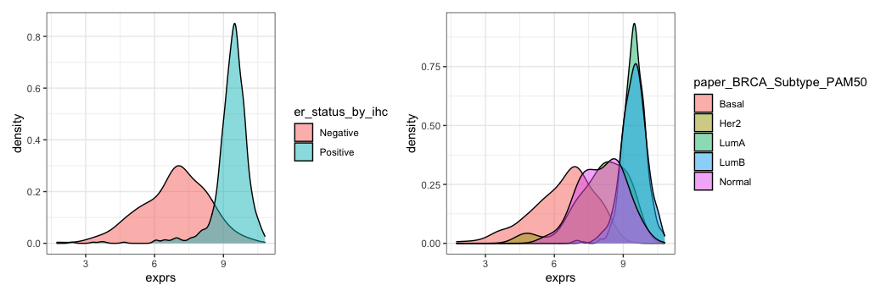

```{r setup, include=FALSE}
library(learnr)
library(gradethis)
library(tidyverse)
library(patchwork)
knitr::opts_chunk$set(echo = FALSE)

brca_norm_mat <-
  readRDS("data/brca_norm_mat.RDS")

brca_subtype_df <-
  read_tsv("data/brca_subtype_df.tsv", show_col_types = FALSE)

# PCA
brca_pca <- prcomp(t(brca_norm_mat))
var_expl <- brca_pca$sdev^2 / sum(brca_pca$sdev^2)
names(var_expl) <- paste0("PC", 1:length(var_expl))
brca_pca_df <-
  brca_pca$x[, 1:10] %>%
  as.data.frame() %>%
  rownames_to_column("barcode") %>%
  as_tibble() %>%
  full_join(brca_subtype_df)

er_plt <-
  brca_pca_df %>%
  ggplot(aes(PC1, PC2, 
             shape = er_status_by_ihc,
             color = er_status_by_ihc)) +
  geom_point() +
  ggsci::scale_color_d3() +
  labs(color = "ER status",
       shape = "ER status",
       x = glue::glue("PC1 [{round(var_expl['PC1']*100, 2)}%]"),
       y = glue::glue("PC2 [{round(var_expl['PC2']*100, 2)}%]")) +
  theme(legend.position = "bottom")

subtype_plt <-
  brca_pca_df %>%
  ggplot(aes(PC1, PC2, 
             shape = paper_BRCA_Subtype_PAM50,
             color = paper_BRCA_Subtype_PAM50)) +
  geom_point() +
  ggsci::scale_color_aaas() +
  guides(color = guide_legend(nrow = 2, byrow = TRUE)) +
  labs(shape = "PAM50 Subtype",
       color = "PAM50 Subtype",
       x = glue::glue("PC1 [{round(var_expl['PC1']*100, 2)}%]"),
       y = glue::glue("PC2 [{round(var_expl['PC2']*100, 2)}%]")) +
  theme(legend.position = "bottom")

pca_plts <-
  er_plt + subtype_plt + 
  plot_annotation("PCA of the TCGA BRCA expression data")

# UMAP
brca_umap <- umap::umap(t(brca_norm_mat))
brca_umap_df <-
  brca_umap$layout %>%
  as.data.frame() %>%
  rownames_to_column("barcode") %>%
  as_tibble() %>%
  left_join(brca_subtype_df)

er_umap_plt <-
  brca_umap_df %>%
  ggplot(aes(V1, V2, 
             shape = er_status_by_ihc,
             color = er_status_by_ihc)) +
  geom_point() +
  ggsci::scale_color_d3() +
  labs(color = "ER status",
       shape = "ER status",
       x = "V1",
       y = "V2") +
  theme(legend.position = "bottom")

subtype_umap_plt <-
  brca_umap_df %>%
  ggplot(aes(V1, V2, 
             shape = paper_BRCA_Subtype_PAM50,
             color = paper_BRCA_Subtype_PAM50)) +
  geom_point() +
  ggsci::scale_color_aaas() +
  guides(color = guide_legend(nrow = 2, byrow = TRUE)) +
  labs(color = "PAM50 Subtype",
       shape = "PAM50 Subtype",
       x = "V1",
       y = "V2") +
  theme(legend.position = "bottom")

# Heatmap 
mat_var <- apply(brca_norm_mat, 1, var)

subset_mat <-
  brca_norm_mat[mat_var > quantile(mat_var, 0.75), ]

heatamap_colors <- 
  rev(c("#67001f", "#b2182b", "#d6604d",
        "#f4a582", "#fddbc7", "#d1e5f0", 
        "#92c5de", "#4393c3", "#2166ac", "#053061"))

ha_df <-
  brca_subtype_df %>%
  select(barcode, 
         `ER status` = er_status_by_ihc, 
         `PAM50 Subtype` = paper_BRCA_Subtype_PAM50) %>%
  column_to_rownames("barcode")

ha_df <- ha_df[colnames(subset_mat), ]

er_statuses <- brca_subtype_df %>%
  pull(er_status_by_ihc) %>%
  unique() %>% sort()

col_er <- ggsci::pal_d3()(length(er_statuses))

names(col_er) <- er_statuses

subtypes <- brca_subtype_df %>% 
  pull(paper_BRCA_Subtype_PAM50) %>%
  unique() %>% sort()

col_subtypes <- ggsci::pal_aaas()(length(subtypes))

names(col_subtypes) <- subtypes
```

## Introduction and background  

Here, we will investigate gene expression data from the TCGA breast cancer cohort. The goal of our analysis will be to find structure and gain some insights into the variation in this gene expression data. 

*Sidenote:* In case you are interested in some background on existing analyses of this publicly available data source, you can check out for example this paper [Comprehensive molecular portraits of human breast tumours](https://www.nature.com/articles/nature11412)

To help guide our analysis, we can rely on some existing knowledge about breast cancer subtypes. Clinically, breast cancer is a heterogeneous disease, often categorised based on estrogen receptor (ER), progesterone receptor (PR) and HER2 status. In here, we focus on two subtype classifications:

* **Estrogen receptor (ER) status**: ER-positive or ER-negative. ER-positive breast cancer have receptors that allow them to use the hormone estrogen to grow. About 80% of all breast cancers are ER-positive. 
* **PAM50 subtype** classification: Breast cancers are classified as Luminal A, Luminal B, HER2 positive, or Basal-like subtypes (these are obtained from 50-gene PAM50 model, with an additional fifth category for normal-like cancers).

### Overview of the data  

Detailed overview how the data was accessed, downloaded and prepared is available in `00_data_preparation` notebook. Do look it up - but please remember *not* to run in Jablonna, as it downloads quite a lot of files we don't need at the moment.

Read in the normalised expression count matrix and sample data.

```{r read_in_data, exercise=TRUE}
brca_norm_mat <-
  readRDS("data/brca_norm_mat.RDS")

brca_subtype_df <-
  read_tsv("data/brca_subtype_df.tsv", show_col_types = FALSE)
```

### Familiarise yourself with the data. 

Expression data in Computational Biology usually comes in a form of a matrix, with samples in columns and genes/transcripts in rows. Look at the data, do your own exploration and then navigate and answer few questions below.

```{r familiarise_data, exercise=TRUE, exercise.line=20}


```


```{r subjects, echo=FALSE}
question("How many subjects are there?",
         answer("1893"),
         answer("1036"),
         answer("1032", correct = TRUE),
         answer("34"),
         random_answer_order = TRUE,
         allow_retry = TRUE,
         incorrect = "Are you sure you are checking correct dimension?"
)
```

```{r samples, echo=FALSE}
question("For how many genes do we have expression values?  ",
  answer("1893", correct = TRUE),
  answer("19997"),
  answer("1032"),
  answer("10000"),
  random_answer_order = TRUE,
  allow_retry = TRUE,
  incorrect = "Are you sure you are checking correct dimension?"
)
```

```{r top_genes, echo=FALSE}
question("Which ER status is more frequent in our data set?",
         answer("The dataset is balanced, roughly the same numbers in each group"),
         answer("Positive", correct = TRUE),
         answer("Negative"),
         random_answer_order = TRUE,
         allow_retry = TRUE)
```


## Basic single-gene analysis  

Unfortunately your supervisor isn't interested in "fancy computational techniques", they want to know how well their favourite gene separates the subgroups. 
So, before proceeding to a multivariate analysis, we focus on the expression of a selected gene (GATA3), and see how well it separates based on

* ER status
* PAM50 subtype

This is the resulting plot (where GATA3 expression values are on x-axis, grouped per subtype):



`r emo::ji("thinking_face")` How do you interpret this plot?

```{r gata3, echo=FALSE}
question("Does GATA3 expression separate patients into ER-positive and ER-negative subgroups? ",
  answer("Yes, GATA3 expression separates the two groups perfectly"),
  answer("Yes, it separates the two groups quite well (but not perfectly)", correct = TRUE),
  answer("No, GATA3 is not useful for predicting ER-status"),
  random_answer_order = FALSE,
  allow_retry = TRUE
)
```

```{r gata3_luminal, echo=FALSE}
question("Does GATA3 expression help us separate patients into Luminal-A and Luminal-B subgroups? ",
  answer("Yes"),
  answer("No", correct = TRUE),
  random_answer_order = FALSE,
  allow_retry = TRUE
)
```

Next, we will discuss how to go beyond single-gene analysis. 

## Dimensionality reduction: PCA   

While the above single-gene analysis shed some light into the data, it does not tell the whole story. 
Also, this approach doesn't generalise to thousands of genes (first we would have to generate thousands of plots and then carefully inspect them). 

We would like to answer the following research questions: 

* Is the separation-by-subtype a generic pattern in the data, or is it specific to this one chosen gene? 
* Which subtypes are the most similar (and least similar), when taking into account the expression of all genes? 
* How well do these pre-defined subtype labels reflect the actual clusters in gene expression data? 
* Can we construct (interpretable) low-dimensional summary statistics from the expression of all genes?

Next, we will try to answer these research questions using unsupervised dimensionality reduction.  

### Principal component analysis   

Let's start by looking at the low-dimensional (2D) representation obtained by the PCA.   

First we need to compute PCA. Do you remember which command to use? *Note:* For the purposes of this example analysis, we will not standardise the features, i.e. we will not scale the log-transformed expression across genes. But is there anything else you need to do with the data matrix first?

Check the hints if you need some help. When you are ready, click `Sumbit answer` to check correctness of your code.

```{r pca, exercise=TRUE}
# your code for PCA
brca_pca <- 
```

```{r pca-hint}
brca_pca <- prcomp(____)

```

```{r pca-solution}
brca_pca <- prcomp(t(brca_norm_mat))
```

```{r pca-check}
grade_this_code()
```

### Variance explained by PCs   

When using top principal components (such as PC1, PC2) as the new coordinate system to represent the data, it is useful to know how much variance these PCs individually (and collectively) explain. 

How many principle components explain at least 1% of variance?

```{r pca_var, exercise=TRUE, fig.width=7}
var_expl <- 

names(var_expl) <- paste0("PC", 1:length(var_expl))

barplot(var_expl[var_expl >= 0.01], col = "darkgreen", 
        main = "Principle components explaining at least 1% of variance.")
```


```{r pca_var-solution}
var_expl <-
  brca_pca$sdev^2 / sum(brca_pca$sdev^2)
```

Let's plot the data in the new coordinate system. 

First, let's create a `data.frame` with PCs and annotation data for easier plotting.

```{r pca_df, exercise=TRUE}
brca_pca_df <-
  brca_pca$x[, 1:10] %>%
  as.data.frame() %>%
  rownames_to_column("barcode") %>%
  as_tibble() %>%
  full_join(brca_subtype_df)
```

And now, let's look at how the data looks like in the new coordination system.

```{r pca_plot, exercise=TRUE, exercise.eval=TRUE}
brca_pca_df %>%
  ggplot(aes(PC1, PC2)) +
  geom_point() +
  labs(title = "PCA of the TCGA BRCA expression data",
       x = glue::glue("PC1 [{round(var_expl['PC1']*100, 2)}%]"),
       y = glue::glue("PC2 [{round(var_expl['PC2']*100, 2)}%]"))
```

Now, try colouring the PC1-PC2 scatter plot by: 1) ER status, and 2) PAM50 subtypes. Do the subtypes separate in the 2D space?

### ER status  

```{r er_status, exercise=TRUE}
# your code to plot (PC1, PC2) coloured by the ER status
```

```{r er_status-hint}
brca_pca_df %>%
  ggplot(aes(PC1, PC2, 
             color = er_status_by_ihc)) +
  geom_point()
```

```{r er_status-solution}
brca_pca_df %>%
  ggplot(aes(PC1, PC2, 
             shape = er_status_by_ihc,
             color = er_status_by_ihc)) +
  geom_point() +
  ggsci::scale_color_d3() +
  labs(title = "PCA of the TCGA BRCA expression data",
       color = "ER status",
       shape = "ER status",
       x = glue::glue("PC1 [{round(var_expl['PC1']*100, 2)}%]"),
       y = glue::glue("PC2 [{round(var_expl['PC2']*100, 2)}%]")) +
  theme(legend.position = "bottom")
```

### PAM50 subtypes  

```{r subtype, exercise=TRUE}
# your code to plot (PC1, PC2) coloured by the subtype
```

```{r subtype-hint}
brca_pca_df %>%
  ggplot(aes(PC1, PC2, 
             color = paper_BRCA_Subtype_PAM50)) +
  geom_point() 
```

```{r subtype-solution}
brca_pca_df %>%
  ggplot(aes(PC1, PC2, 
             shape = paper_BRCA_Subtype_PAM50,
             color = paper_BRCA_Subtype_PAM50)) +
  geom_point() +
  ggsci::scale_color_aaas() +
  labs(title = "PCA of the TCGA BRCA expression data",
       shape = "PAM50 Subtype",
       color = "PAM50 Subtype",
       x = glue::glue("PC1 [{round(var_expl['PC1']*100, 2)}%]"),
       y = glue::glue("PC2 [{round(var_expl['PC2']*100, 2)}%]")) +
  theme(legend.position = "bottom")
```

### PCA plot with subtypes / ER status  

This is how those plots look side by side.

```{r pca_plots}
pca_plts
```

`r emo::ji("thinking_face")` Can you assign an interpretation to the first principal component? What about the second principal component? Are they both relevant for 1) ER status, and 2) some/all of PAM50 subtype classification?

```{r pca_er, echo=FALSE}
question("Which of the two principal components is more useful for ER status classification?",
  answer("PC1", correct = TRUE),
  answer("PC2"),
  random_answer_order = FALSE,
  allow_retry = TRUE
)
```

`r emo::ji("question")` We can formally look into what "drives" the principal components by looking at the gene coefficients.

### Next, try looking at which genes "drive" PC1 (and PC2) most.  

```{r pc1_driver, exercise=TRUE}


```

```{r pc1_driver-solution}
brca_rotation_df <-
  brca_pca$rotation[, 1:10] %>%
  as.data.frame() %>%
  rownames_to_column("gene") %>%
  as_tibble() %>%
  pivot_longer(names_to = "pc",
               values_to = "value",
               -gene)

brca_rotation_df %>%
  filter(pc == "PC1") %>%
  slice_max(n = 5, abs(value))

brca_rotation_df %>%
  filter(pc == "PC2") %>%
  slice_max(n = 5, abs(value))
```

`r emo::ji("person_taking_bath")` Are the top genes similar to the result we would have gotten if we had instead looked for genes that have the largest differences between ER+ and ER- subgroups? (I.e. what if we had done a *supervised* analysis instead, using ER status as a label)

## Dimensionality reduction: UMAP

We can similarly look at the low-dimensional representation from UMAP, coloured by the subtype information. 

```{r umap, exercise=TRUE, warning=FALSE, exercise.blanks="___+"}
brca_umap <- umap::umap(_____)
```

```{r umap-solution}
brca_umap <- umap::umap(t(brca_norm_mat))
```

```{r umap-check}
grade_this_code()
```

### Now, let's look at the data in the UMAP coordinate system. 

```{r umap_plots, exercise=TRUE, exercise.lines=30}
brca_umap_df <-
  brca_umap$layout %>%
  as.data.frame() %>%
  rownames_to_column("barcode") %>%
  as_tibble() %>%
  left_join(brca_subtype_df)

# your plots here

```

```{r umap_plots-hint}
# simple plot
brca_umap_df %>%
  ggplot(aes(V1, V2, 
             color = er_status_by_ihc)) +
  geom_point() 

brca_umap_df %>%
  ggplot(aes(V1, V2, 
             color = paper_BRCA_Subtype_PAM50)) +
  geom_point()
```

```{r umap_plots-solution}
# using `patchwork` for combining the plots 
# and `ggsci` for more control over colors
er_umap_plt <-
  brca_umap_df %>%
  ggplot(aes(V1, V2, 
             shape = er_status_by_ihc,
             color = er_status_by_ihc)) +
  geom_point() +
  ggsci::scale_color_d3() +
  labs(color = "ER status",
       shape = "ER status",
       x = "V1",
       y = "V2") +
  theme(legend.position = "bottom")

subtype_umap_plt <-
  brca_umap_df %>%
  ggplot(aes(V1, V2, 
             shape = paper_BRCA_Subtype_PAM50,
             color = paper_BRCA_Subtype_PAM50)) +
  geom_point() +
  ggsci::scale_color_aaas() +
  guides(color = guide_legend(nrow = 2, byrow = TRUE)) +
  labs(color = "PAM50 Subtype",
       shape = "PAM50 Subtype",
       x = "V1",
       y = "V2") +
  theme(legend.position = "bottom")

er_umap_plt + subtype_umap_plt + 
    plot_annotation("UMAP of the TCGA BRCA expression data")
```

Does UMAP cluster patients based on 1) ER-status and 2) PAM50 subtypes? 

Unfortunately, unlike for PCA, for UMAP we cannot ask "which genes drive UMAP coordinates". 

### Compare the dimensionality representations  

```{r compare_plots, fig.width=7, fig.height=7}
umap_plts <-
  er_umap_plt + subtype_umap_plt + 
    plot_annotation("UMAP of the TCGA BRCA expression data")

(umap_plts & labs(title = "UMAP")) / (pca_plts & labs(title = "PCA"))
```

`r emo::ji("thinking_face")` If you had to choose between the PCA and UMAP plots, which one would you choose to present? Why?

## Clustering: k-means

So far, we have been exploring structure in the data, assuming that there are known groups. However, in practice, when analysing a new data set, previously characterised groups may not always be applicable to our study. Therefore, it would be interesting to see how much they differ from an unsupervised clustering of our own. 

First, let's try out k-means. Running k-means will require first some choices:

* Which $k$ value should we choose? 
* Should we run k-means on the low-dimensional representation or high-dimensional data?


```{r k_means, exercise=TRUE, fig.width=7, fig.height=7, exercise.lines=30, exercise.blanks="___+"}
k <- ____

brca_kmeans <- ____

kmeans_df <-
  brca_pca_df %>%
  mutate(cluster = as.factor(brca_kmeans$cluster)) 

kmeans_plt <-
  kmeans_df %>%
  ggplot(aes(PC1, PC2, 
             shape = cluster,
             color = cluster)) +
  geom_point() +
  ggsci::scale_color_jco() +
  labs(color = "K-means cluster",
       shape = "K-means cluster",
       x = glue::glue("PC1 [{round(var_expl['PC1']*100, 2)}%]"),
       y = glue::glue("PC2 [{round(var_expl['PC2']*100, 2)}%]")) +
  theme(legend.position = "bottom")

design_ <-
  "AA
   AA
   AA
   BC
   BC"
kmeans_plt + er_plt + subtype_plt + 
  plot_layout(design = design_)
```

```{r k_means-solution, fig.width=7, fig.height=7}
k <- 5 # for example
brca_kmeans <- kmeans(t(brca_norm_mat), k)
```

### How well do k-means clusters align with the pre-defined subtypes?  

How can you check how the cluster assignments agree with subtypes or ER status? How changing the $k$ changes that assignment?

```{r alignment, exercise=TRUE, exercise.blanks="___+", exercise.lines=20}
k <- ____ # try different values

brca_kmeans <- kmeans(t(brca_norm_mat), k)

kmeans_df <-
  brca_pca_df %>%
  mutate(cluster = as.factor(brca_kmeans$cluster))

```


```{r alignment-hint, exercise.lines=20}
k <- 5 # try different values
brca_kmeans <- kmeans(t(brca_norm_mat), k)
kmeans_df <-
  brca_pca_df %>%
  mutate(cluster = as.factor(brca_kmeans$cluster))

kmeans_df %>% 
  select(cluster, er_status_by_ihc) %>%
  table() 

kmeans_df %>% 
  select(cluster, paper_BRCA_Subtype_PAM50) %>%
  table()
```

```{r alignment-solution}
k <- 5 # try different values
brca_kmeans <- kmeans(t(brca_norm_mat), k)
kmeans_df <-
  brca_pca_df %>%
  mutate(cluster = as.factor(brca_kmeans$cluster))

kmeans_df %>% 
  select(cluster, er_status_by_ihc) %>%
  table() %>%
  as.data.frame() %>%
  ggplot(aes(cluster, er_status_by_ihc,
             fill = Freq, label = Freq, size = Freq)) +
  geom_label(color = "white") +
  labs(x = "K-means cluster", y = "ER status") +
  theme_linedraw() +
  theme(legend.position = "none")

kmeans_df %>% 
  select(cluster, paper_BRCA_Subtype_PAM50) %>%
  table() %>%
  as.data.frame() %>%
  ggplot(aes(cluster, paper_BRCA_Subtype_PAM50,
             fill = Freq, label = Freq, size = Freq)) +
  geom_label(color = "white") +
  labs(x = "K-means cluster", y = "PAM50 subtype") +
  theme_linedraw() +
  theme(legend.position = "none")
```


### How stable is the k-means output, when running it repeatedly?

```{r stability, exercise=TRUE, exercise.blanks="___+", exercise.lines=15}
k <- ____
n_iterations <- ____

# run multiple iterations and collate them into one matrix
stability_mat <- 
  sapply(1:n_iterations, 
         function(x) kmeans(t(brca_norm_mat), k)$cluster)


```


```{r stability-solution}
k <- 2
n_iterations <- 10

# run multiple iterations and collate them into one matrix
stability_mat <- 
  sapply(1:n_iterations, 
         function(x) kmeans(t(brca_norm_mat), k)$cluster)

colnames(stability_mat) <- 
  paste0("iter ", 1:n_iterations)

# visualise with Heatmap
ComplexHeatmap::Heatmap(stability_mat, show_column_names = TRUE, 
                        name = "Stability\nmatrix",
                        cluster_rows = TRUE, show_row_dend = FALSE, 
                        show_row_names = FALSE, cluster_columns = FALSE, 
                        col = ggsci::pal_futurama()(k))
```

`r emo::ji("thinking_face")` How does $k$ influence stability? 

`r emo::ji("thinking_face")` Can you say which $k$ is best for clustering based on the alignment with known subtypes and stability of the clusters? 

### Choosing best k  

When we are unsure how to choose what is the best number of clusters, we can try out running k-means with varying k values, and plotting the respective within-cluster sum-of-squares. 

Try out a reasonable range of k values, and create such plot. 

```{r wss, exercise=TRUE, exercise.blanks="___+", }
ks <- ____
wss_df <-
  lapply(ks, function(k) {
    tibble(k = k, 
           wss = kmeans(t(brca_norm_mat), k)$tot.withinss)
}) %>%
  bind_rows()
```


```{r wss-solution}
ks <- 2:10 # try different values
wss_df <-
  lapply(ks, function(k) {
    tibble(k = k, 
           wss = kmeans(t(brca_norm_mat), k)$tot.withinss)
}) %>%
  bind_rows()
    
wss_df %>%
  ggplot(aes(k, wss)) +
  geom_point() +
  geom_line() +
  labs(x = "k (number of clusters)", 
       y = "Within cluster sum of squares")
```

`r emo::ji("thinking_face")` Which k would you choose? How well does this align with the number of pre-defined subtypes?


## Clustering: hierarchical

It is common to see heatmaps whose rows and/or columns are ordered based on a hierachical clustering tree. These heatmaps can be quite helpful in visualising patterns in high-dimensional omics data, and can be more insightful than simply looking at the plain dendrogram on its own.  

Use the `ComplexHeatmap` package to create such a visualisation. 

```{r heatmap, exercise=TRUE, exercise.eval=TRUE, exercise.lines=15}
mat_var <- apply(brca_norm_mat, 1, var)

subset_mat <-
  brca_norm_mat[mat_var > quantile(mat_var, 0.75), ]

heatamap_colors <- 
  rev(c("#67001f", "#b2182b", "#d6604d",
        "#f4a582", "#fddbc7", "#d1e5f0", 
        "#92c5de", "#4393c3", "#2166ac", "#053061"))

ComplexHeatmap::Heatmap(subset_mat, name = "TCGA BRCA\nexpression",
                        col = heatamap_colors,
                        show_row_names = FALSE, show_column_names = FALSE)

```

Now we will add annotations with pre-defined subtypes.

```{r heatmap_annotated, exercise=TRUE, exercise.eval=TRUE, exercise.lines=35}
ha_df <-
  brca_subtype_df %>%
  select(barcode, 
         `ER status` = er_status_by_ihc, 
         `PAM50 Subtype` = paper_BRCA_Subtype_PAM50) %>%
  column_to_rownames("barcode")

ha_df <- ha_df[colnames(subset_mat), ]

er_statuses <- brca_subtype_df %>%
  pull(er_status_by_ihc) %>%
  unique() %>% sort()

col_er <- ggsci::pal_d3()(length(er_statuses))

names(col_er) <- er_statuses

subtypes <- brca_subtype_df %>% 
  pull(paper_BRCA_Subtype_PAM50) %>%
  unique() %>% sort()

col_subtypes <- ggsci::pal_aaas()(length(subtypes))

names(col_subtypes) <- subtypes

ha <-
  ComplexHeatmap::HeatmapAnnotation(df = ha_df, 
                                    col = list(`ER status` = col_er,
                                               `PAM50 Subtype` = col_subtypes))

ComplexHeatmap::Heatmap(subset_mat, name = "TCGA BRCA\nexpression",
                        col = heatamap_colors,
                        show_row_names = FALSE, show_column_names = FALSE,
                        bottom_annotation = ha)
```


```{r split, exercise=TRUE, exercise.blanks="___+"}
split_ <- ____

ha <-
  ComplexHeatmap::HeatmapAnnotation(df = ha_df, 
                                    col = list(`ER status` = col_er,
                                               `PAM50 Subtype` = col_subtypes))

ComplexHeatmap::Heatmap(subset_mat, name = "TCGA BRCA\nexpression",
                        col = heatamap_colors,
                        show_row_names = FALSE, show_column_names = FALSE,
                        bottom_annotation = ha, column_split = split_)
```

`r emo::ji("thinking_face")` Is it easier to decide how many clusters there are in the data looking at the Heatmap or in the PCA space?